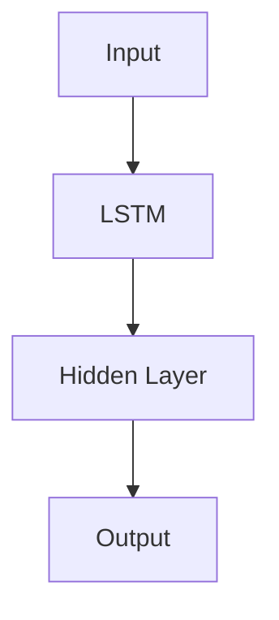

# Fire Forest Monthly Prediction

Predicting fire potential in West Kalimantan, Indonesia. Made for a thesis at Telkom University Purwokerto.

[//]: # (![License]&#40;https://img.shields.io/github/license/dipp-12/fire-forest-monthly-prediction&#41;)
[//]: # (![Issues]&#40;https://img.shields.io/github/issues/dipp-12/fire-forest-monthly-prediction&#41;)
[//]: # (![Forks]&#40;https://img.shields.io/github/forks/dipp-12/fire-forest-monthly-prediction&#41;)
[//]: # (![Stars]&#40;https://img.shields.io/github/stars/dipp-12/fire-forest-monthly-prediction&#41;)

## Description
This project aims to solve fire forest problem that's often happen in West Kalimantan, Indonesia. The model will predict
the fire potential in the next month based on the data from the previous month. The data used in this project is Land 
Surface Temperature (LST) from MODIS satellite.

## Dataset
The dataset used in this project is the MOD21C3 from MODIS satellite provided by Google Earth Engine. The dataset is 
available in https://developers.google.com/earth-engine/datasets/catalog/MODIS_061_MOD21C3. Since there is limitation of size in GitHub, I 
didn't upload the dataset here. You can find the code in my kaggle dataset [here](https://www.kaggle.com/datasets/muhammadnadhifn/west-kalimantan-mod21c3).

## Notebooks Explanation
I provided some code/notebook on this repository to gathering and preprocessing the data:
1. get_data_mod21c3.ipynb - This notebook is used to gather the data from MODIS satellite using GEE API and stored in pickle format.
2. convert_raw_pickel_data.ipynb - This notebook is used to preprocess and convert the raw pickle data into CSV.
3. split_data.ipynb - This notebook is used to do data cleaning and split the data into training and testing data.
4. modeling.ipynb - This notebook is used to train the model.
5. testing.ipynb - This notebook is used to test and evaluate the model.
6. predict.ipynb - This notebook is used to predict the fire potential in the next month.
 

I also made predict.py to predict the fire potential in the next month and generate the result in the form map using folium in web.

## About the Model

## Prediction Result

This prediction result can be accessed in [nadhif.me/fire-forest-monthly-prediction](https://nadhif.me/fire-forest-monthly-prediction).

